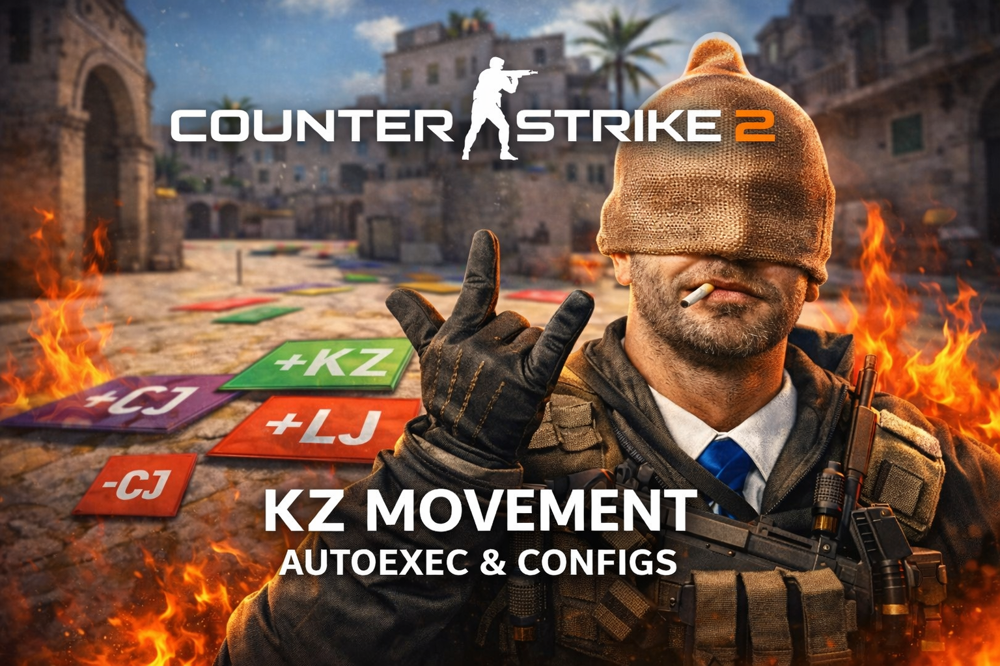

<p align="center">
  
</p>

<h1 align="center">CS2 Autoexec & Movement Config</h1>

<p align="center">
  KZ • Long Jump • Count Jump • Practice configs for Counter-Strike 2
</p>

---

# CS2 Autoexec & Movement Config

Configuración avanzada para **Counter-Strike 2** orientada a:

* Movement
* KZ
* Long Jump
* Count Jump
* Practice

Incluye una **configuración modular profesional**, con instalación automática mediante script.

---

# 🚀 Características

Esta configuración incluye:

### 🎮 Movement

* Bhop optimizado
* Scripts de movement
* Configuración para **KZ / LJ / CJ**

### ⚙️ Configuración modular

La configuración está dividida en módulos para facilitar su mantenimiento:

* `core`
* `crosshair`
* `viewmodel`
* `radar`
* `audio`
* `movement`
* `binds`
* `utilities`

Esto permite mantener la configuración **limpia, profesional y fácil de modificar**.

---

### 📸 Photo Mode

Modo especial para capturas y clips:

* Oculta HUD
* Ajusta gamma
* Aplica desenfoque
* Cambia viewmodel

Comando en consola:

```
photo
```

---

### 🔇 Clutch Mute

Mutea automáticamente el voice chat para concentrarte en clutch.

Tecla:

```
Right ALT
```

---

### 💣 C4 Quick Drop

Drop rápido de C4 para pasarla a compañeros.

Tecla:

```
J
```

---

### 🔊 Control rápido de volumen

Cambiar volumen del juego con confirmación sonora.

| Tecla | Volumen |
| ----- | ------- |
| F4    | Bajo    |
| F5    | Medio   |
| F6    | Alto    |

---

# 📂 Estructura del proyecto

```
CS2-AUTOEXEC
│
├─ assets
│  └─ banner.png
│
├─ CFG
│  ├─ dynamic_hud.cfg
│  └─ practicacs2.cfg
│
├─ configs
│  ├─ core.cfg
│  ├─ crosshair.cfg
│  ├─ viewmodel.cfg
│  ├─ radar.cfg
│  ├─ audio.cfg
│  ├─ movement.cfg
│  ├─ binds.cfg
│  └─ utilities.cfg
│
├─ otag
│  ├─ -cj.cfg
│  ├─ +cj.cfg
│  ├─ +lj.cfg
│  └─ jb.cfg
│
├─ autoexec.cfg
├─ kz.cfg
└─ install_cfg.bat
```

---

# 📄 Archivos principales

| Archivo         | Descripción                                         |
| --------------- | --------------------------------------------------- |
| autoexec.cfg    | Configuración principal cargada al iniciar el juego |
| core.cfg        | Configuración básica del cliente                    |
| crosshair.cfg   | Configuración de la mira                            |
| viewmodel.cfg   | Posición del arma                                   |
| radar.cfg       | Configuración del radar                             |
| audio.cfg       | Ajustes de sonido                                   |
| movement.cfg    | Configuración de movimiento                         |
| binds.cfg       | Binds principales                                   |
| utilities.cfg   | Photo mode, clutch mute y utilidades                |
| kz.cfg          | Configuración KZ                                    |
| practicacs2.cfg | Configuración de práctica                           |
| dynamic_hud.cfg | HUD dinámico                                        |

---

# ⚡ Instalación automática (recomendado)

1. Descarga el repositorio

```
git clone https://github.com/TU_USUARIO/cs2-autoexec
```

o descarga el **ZIP**.

2. Ejecuta:

```
install_cfg.bat
```

El instalador:

* detectará automáticamente la carpeta de CS2
* copiará todos los archivos necesarios
* instalará la configuración completa

---

# ⚙️ Activar autoexec en Steam

1. Abre **Steam**
2. Ve a tu biblioteca
3. Click derecho en **Counter-Strike 2**
4. Propiedades
5. En **Opciones de lanzamiento** añade:

```
+exec autoexec.cfg
```

---

# 🛠 Instalación manual

Ve a:

```
Steam\steamapps\common\Counter-Strike Global Offensive\game\csgo\cfg
```

Copia dentro:

```
autoexec.cfg
kz.cfg
practicacs2.cfg
dynamic_hud.cfg

core.cfg
crosshair.cfg
viewmodel.cfg
radar.cfg
audio.cfg
movement.cfg
binds.cfg
utilities.cfg

+cj.cfg
-cj.cfg
+lj.cfg
jb.cfg
```

---

# 🎮 Comandos útiles

Dentro del juego puedes ejecutar:

```
exec kz
practice
photo
hud
```

---

# 🧠 Recomendado para

* KZ players
* Movement practice
* Long Jump training
* Count Jump practice
* Private servers

---

# 🔄 Actualizar configuración

Si el repositorio recibe cambios:

1. Descarga la nueva versión
2. Ejecuta nuevamente:

```
install_cfg.bat
```

---

# 👤 Autor

**elemikelo**

Configuración avanzada para Counter-Strike 2.

---

# 📄 Licencia

Uso libre para **práctica, aprendizaje y movement**.
