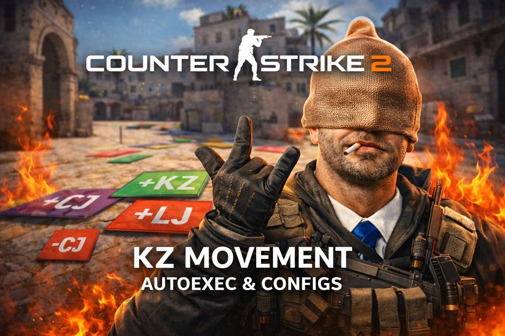

<p align="center">
  
</p>

<h1 align="center">⚙️ CS2 Autoexec & Movement Config</h1>

<p align="center">
Configuración profesional modular para Counter-Strike 2
</p>

<p align="center">
  
  
  
  
</p>

---

## 📋 Descripción

Configuración avanzada y profesional para **Counter-Strike 2**, diseñada para jugadores competitivos que buscan optimizar:

- ✅ **Rendimiento** - Configuración de red y gráficos para máximo FPS
- ✅ **Movimiento** - Scripts optimizados para bhop, KZ, Long Jump y Count Jump
- ✅ **Competitivo** - Mejora de visibilidad y sonido para juego competitivo
- ✅ **Flexibilidad** - Sistema modular fácil de personalizar

Incluye **instalación automática** mediante script y soporte para múltiples modos de juego.

---

## 🚀 Características Principales

### 🎮 Configuración de Movimiento Avanzada

Soporta los estilos de movimiento más populares con scripts optimizados:

| Tipo | Archivo | Descripción |
|------|---------|-------------|
| **KZ** | `movement/kz.cfg` | Configuración para servidores Kreedz (saltos precisos) |
| **Long Jump** | `movement/+lj.cfg` | Script para Long Jumps optimizados |
| **Count Jump** | `movement/+cj.cfg` | Script para Count Jumps con duck |
| **Bunny Hop** | `config/movement.cfg` | Bhop optimizado con rueda del ratón |
| **Jumpbug** | `movement/jb.cfg` | Script para Jumpbugs en KZ |
| **Normal** | `movement/-cj.cfg` | Configuración estándar de movimiento |

**Binds de Movimiento:**
- `Mouse Wheel Up/Down` - Saltar (Bhop)
- `Space` - Salto normal
- `Ctrl` - Agacharse

---

### ⚙️ Configuración Modular

La configuración está **dividida en módulos independientes** para mayor mantenibilidad:

```
config/
├── core.cfg          # Configuración básica (FPS, rate, input)
├── video.cfg         # Ajustes visuales y gráficos
├── audio.cfg         # Configuración de audio y sonido
├── crosshair.cfg     # Mira personalizada
├── viewmodel.cfg     # Posición y rotación del arma
├── radar.cfg         # Configuración del radar
├── binds.cfg         # Controles y keybinds
├── movement.cfg      # Movimiento (bhop, saltos)
├── utilities.cfg     # Funciones especiales
├── dynamic_hud.cfg   # HUD dinámico
├── practicacs2.cfg   # Modo práctica local
└── kz.cfg            # Presets para KZ
```

Cada módulo es **independiente** y se puede modificar sin afectar otros.

---

### 📸 Modo Foto

Modo especial optimizado para capturar screenshots y grabar clips.

**Comando:**
```
photo
```

**Cambios al activar:**
- HUD oculto para vista clara
- Gamma ajustada (3.0) para mejor iluminación
- Profundidad de campo aumentada
- Viewmodel ajustado para mejor composición

Ejecuta el comando nuevamente para desactivar.

---

### 🔇 Clutch Mute (Muteo de Clutch)

Mutea automáticamente el voice chat del servidor para máxima concentración en momentos críticos.

**Tecla:** `Right ALT`

Incluye feedback visual con sonido de confirmación.

---

### 💣 Controles Especiales

**Quick Weapon Slots:**
- `Mouse4` - Flashbang (slot7)
- `Mouse5` - Smoke (slot8)
- `1` - Arma principal
- `2` - Pistola
- `3` - Cuchillo

**Acciones Comunes:**
- `R` - Recargar
- `E` - Usar/Plantar bomba/Defuse
- `G` - Soltar arma
- `F` - Inspeccionar arma
- `B` - Abrir menú de compra
- `` ` `` - Abrir consola

---

### 🎯 Configuración Visual

**Mira Personalizada:**
- Color verde personalizado (RGB: 50, 250, 50)
- Tamaño óptimo (2)
- Gap dinámico para visibilidad
- Sin punto central para claridad

**Video & Gráficos:**
- FPS ilimitados (fps_max 0)
- Visibilidad de enemigos mejorada
- Trazadoras de balas visibles
- Gamma ajustable (2.8)
- Rate máximo de red (1000000)

---

### 🔊 Configuración de Audio

Optimizada para competitivo con focus en sonidos importantes:

- Música desactivada (juego y menú)
- Audio directional mejorado
- Baja latencia (snd_mixahead 0.025)
- Ecualizador para auriculares activado
- Sonidos de UI reducidos

---

### 🖱️ Configuración de Ratón

- Sensibilidad base: 1.10
- Raw input activado (sin aceleración de Windows)
- Sensibilidad al zoom: 1.0
- Sin aceleración del ratón

---

## 💻 Instalación

### Opción 1: Instalación Automática (Recomendado)

Ejecuta el script de instalación automático:

```bash
install_cfg.bat
```

El script:
1. Detecta automáticamente la ruta de instalación de CS2
2. Soporta múltiples ubicaciones (C:, D:, E:)
3. Copia todos los archivos de configuración
4. Crea la carpeta `cfg` si no existe

**Si la detección automática falla:**
- El script te pedirá la ruta manualmente
- Ruta típica: `C:\Program Files (x86)\Steam\steamapps\common\Counter-Strike Global Offensive\game\csgo\cfg`

### Opción 2: Instalación Manual

1. Abre tu carpeta de instalación de CS2: `SteamLibrary/steamapps/common/Counter-Strike Global Offensive/game/csgo/cfg`
2. Copia todos los archivos y carpetas del proyecto:
   - `autoexec.cfg`
   - `config/` (carpeta completa)
   - `movement/` (carpeta completa)
3. Reinicia CS2 o ejecuta en consola: `exec autoexec`

---

## 📁 Estructura del Proyecto

```
cs2-autoexec/
├── autoexec.cfg          # Archivo principal que carga todo
├── install_cfg.bat       # Script de instalación automática
├── README.md             # Este archivo
├── assets/               # Recursos (banners, imágenes)
│   └── banner.png
├── config/               # Módulos de configuración
│   ├── core.cfg          # Configuración básica
│   ├── video.cfg         # Gráficos y visual
│   ├── audio.cfg         # Audio
│   ├── crosshair.cfg     # Mira
│   ├── viewmodel.cfg     # Arma en pantalla
│   ├── radar.cfg         # Radar
│   ├── binds.cfg         # Controles
│   ├── movement.cfg      # Movimiento general
│   ├── utilities.cfg     # Funciones especiales
│   ├── dynamic_hud.cfg   # HUD dinámico
│   ├── practicacs2.cfg   # Modo práctica
│   └── kz.cfg            # Configuración KZ
└── movement/             # Scripts de movimiento
    ├── kz.cfg            # KZ (Kreedz)
    ├── +lj.cfg           # Long Jump
    ├── +cj.cfg           # Count Jump (con duck)
    ├── -cj.cfg           # Count Jump (sin duck)
    └── jb.cfg            # Jumpbug
```

---

## 🎮 Cómo Usar

### Cargar la Configuración Principal

Una vez instalado, CS2 cargará automáticamente el `autoexec.cfg` al iniciar.

**En consola del juego:**
```
exec autoexec
```

### Cambiar entre Modos

La configuración incluye aliases para cambiar rápidamente entre modos:

```
// Cargar configuración normal
normal

// Cargar configuración de práctica
practice

// Cargar configuración de KZ
kz

// Activar/Desactivar HUD dinámico
hud
```

### Cargar Configuración Personalizada de Movimiento

Puedes cargar diferentes configuraciones de movimiento según el servidor:

**En consola:**
```
exec config/kz        // Para servidores KZ
exec movement/+lj     // Para Long Jump
exec movement/+cj     // Para Count Jump
```

---

## 🎛️ Personalización

### Modificar la Mira

Edita `config/crosshair.cfg`:
```
cl_crosshaircolor_r 50    // Rojo (0-255)
cl_crosshaircolor_g 250   // Verde (0-255)
cl_crosshaircolor_b 50    // Azul (0-255)
cl_crosshairsize 2        // Tamaño
cl_crosshairgap -2.0      // Gap central
```

### Cambiar Sensibilidad del Ratón

Edita `config/core.cfg`:
```
sensitivity 1.10          // Aumenta/disminuye
zoom_sensitivity_ratio 1  // Sensibilidad con zoom
```

### Modificar Controles

Edita `config/binds.cfg` para personalizar keybinds:
```
bind "KEY" "action"        // Bind nuevo
bind "mouse4" "slot7"      // Bind del ratón
```

### Ajustar Gráficos

Edita `config/video.cfg` para cambiar:
```
fps_max 0                  // FPS máximo
r_fullscreen_gamma 2.8     // Gamma/brillo
```

---

## 📊 Especificaciones Técnicas

### Red
- **Rate:** 1000000 (máximo)
- **Update Rate:** 128
- **Cmd Rate:** 128
- **Interpolation:** 0 (mínima)
- **Interp Ratio:** 1

### Video
- **FPS:** Sin límite
- **Gamma:** 2.8 (competitivo)
- **Input:** Raw (sin aceleración)
- **Sensibilidad:** 1.10 (Sensibilidad baja)

### Audio
- **Latencia:** 0.025ms (muy baja)
- **Musik:** Desactivada
- **Mode:** Headphone EQ activado

---

## 🔄 Actualizaciones y Versiones

**Configuración actual:**
- Optimizada para Counter-Strike 2
- Compatible con servidores comunitarios KZ
- Testeada en juego competitivo

---

## 📝 Notas Importantes

1. **Permisos:** Asegúrate de que CS2 tiene permisos para escribir en la carpeta `cfg`
2. **Backup:** Realiza backup de tu `autoexec.cfg` anterior antes de instalar
3. **Antivirus:** Algunos antivirus pueden bloquear scripts batch; añade a excepciones si es necesario
4. **Comandos de Red:** Los valores de `rate` y `updaterate` dependen de tu conexión
5. **Modos de Servidor:** Algunos servidores pueden tener restricciones de configuración

---

## 🆘 Solución de Problemas

### La configuración no se carga
- Verifica que `autoexec.cfg` esté en la carpeta correcta
- Ejecuta manualmente: `exec autoexec` en la consola
- Reinicia CS2

### Los controles no funcionan
- Abre `config/binds.cfg` y verifica las teclas
- Asegúrate de que no haya conflictos con controles de CS2
- Algunos servidores pueden bloquear ciertos binds

### FPS bajos
- Edita `config/video.cfg` y ajusta `fps_max`
- Reduce `rate` si tienes conexión lenta
- Desactiva sombras y efectos en video.cfg

### Audio distorsionado
- Reduce `snd_mixahead` en `config/audio.cfg`
- Verifica que el volumen no esté en 0
- Cambia `snd_headphone_eq` a 0 si usas speakers

---

## 🤝 Contribuir

Para reportar bugs o sugerir mejoras, contacta o abre un issue en el repositorio.

---

## 📜 Licencia

Libre para usar y modificar. Hecho por **elemikelo**.

---

**Última actualización:** 2026
**Versión:** 2.0 (CS2 Optimizada)

------------------------------------------------------------------------

## 🔊 Control rápido de volumen

  Tecla   Volumen
  ------- ---------
  F4      Bajo
  F5      Medio
  F6      Alto

------------------------------------------------------------------------

# 📂 Estructura del proyecto

    CS2-AUTOEXEC
    │
    ├ assets
    │  └ banner.png
    │
    ├ config
    │  ├ core.cfg
    │  ├ crosshair.cfg
    │  ├ viewmodel.cfg
    │  ├ radar.cfg
    │  ├ audio.cfg
    │  ├ movement.cfg
    │  ├ binds.cfg
    │  ├ utilities.cfg
    │  ├ kz.cfg
    │  ├ practicacs2.cfg
    │  └ dynamic_hud.cfg
    │
    ├ movement
    │  ├ -cj.cfg
    │  ├ +cj.cfg
    │  ├ +lj.cfg
    │  └ jb.cfg
    │
    ├ autoexec.cfg
    ├ install_cfg.bat
    └ README.md

------------------------------------------------------------------------

# 📄 Archivos principales

  Archivo           Descripción
  ----------------- -----------------------------------------------------
  autoexec.cfg      Configuración principal cargada al iniciar el juego
  core.cfg          Configuración básica del cliente
  crosshair.cfg     Configuración de la mira
  viewmodel.cfg     Posición del arma
  radar.cfg         Configuración del radar
  audio.cfg         Ajustes de sonido
  movement.cfg      Configuración de movimiento
  binds.cfg         Binds principales
  utilities.cfg     Photo mode, clutch mute y utilidades
  kz.cfg            Configuración para servidores KZ
  practicacs2.cfg   Configuración de práctica
  dynamic_hud.cfg   HUD dinámico

------------------------------------------------------------------------

# ⚡ Instalación automática (recomendado)

1️⃣ Descarga el repositorio

    git clone https://github.com/TU_USUARIO/cs2-autoexec

o descarga el **ZIP**.

2️⃣ Ejecuta:

    install_cfg.bat

El instalador:

-   detecta automáticamente la carpeta de configuración de CS2
-   copia todos los archivos `.cfg` del proyecto
-   instala la configuración completa automáticamente

------------------------------------------------------------------------

# ⚙️ Activar autoexec en Steam

1.  Abre **Steam**
2.  Ve a tu biblioteca
3.  Click derecho en **Counter‑Strike 2**
4.  Propiedades
5.  En **Opciones de lanzamiento** añade:

```{=html}
<!-- -->
```
    +exec autoexec.cfg

------------------------------------------------------------------------

# 🛠 Instalación manual

1.  Ve a:

```{=html}
<!-- -->
```
    Steam\steamapps\common\Counter-Strike Global Offensive\game\csgo\cfg

2.  Copia dentro **todos los archivos `.cfg` del proyecto**.

------------------------------------------------------------------------

# 🎮 Comandos útiles

Dentro del juego puedes ejecutar:

    practice
    exec kz
    photo
    hud

------------------------------------------------------------------------

# 🧠 Recomendado para

-   KZ players
-   Movement practice
-   Long Jump training
-   Count Jump practice
-   Private servers

------------------------------------------------------------------------

# 🔄 Actualizar configuración

1.  Descarga la nueva versión
2.  Ejecuta nuevamente:

```{=html}
<!-- -->
```
    install_cfg.bat

------------------------------------------------------------------------

# 👤 Autor

Configuración creada por:

**@elemikelo**

Instagram: https://www.instagram.com/elemikelo/

------------------------------------------------------------------------

# 📄 Licencia

Uso libre para **práctica, aprendizaje y movement**.
